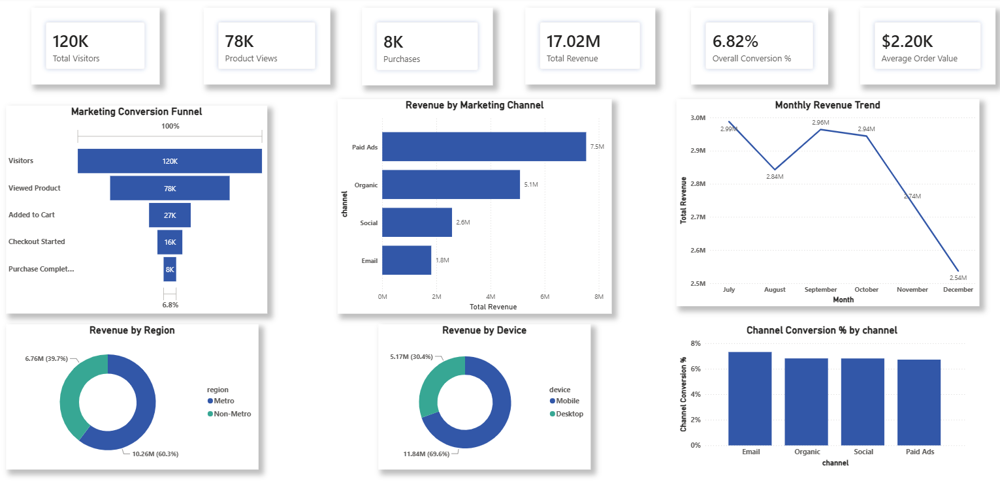

# Marketing Funnel Performance Analysis

## Future Interns – Data Science & Analytics Internship

This project analyzes a marketing funnel dataset to evaluate customer behavior, conversion performance, and revenue generation across different marketing channels. The analysis was performed using Python for data processing and visualization, followed by an interactive Power BI dashboard for business insights.

---

## Project Objectives

- Analyze customer progression through the marketing funnel.
- Measure conversion rates at each funnel stage.
- Identify user drop-offs.
- Compare revenue across marketing channels.
- Evaluate campaign performance.
- Analyze customer behavior by device and region.
- Build an interactive Power BI dashboard for business decision-making.

---

## Dataset

The dataset contains **120,000 customer sessions** with information including:

- User and session details
- Marketing channel
- Campaign type
- Device type
- User type
- Region
- Funnel stages
- Order value
- Revenue

---

## Technologies Used

- Python
- Pandas
- NumPy
- Matplotlib
- Seaborn
- Power BI

---

## Exploratory Data Analysis

The analysis included:

- Data inspection
- Missing value analysis
- Duplicate record detection
- Data type conversion
- Categorical variable analysis
- Revenue analysis
- Funnel analysis
- Conversion rate analysis
- Customer drop-off analysis
- Correlation analysis
- KPI generation

---

## Key Insights

### Marketing Funnel

- Total Visitors: **120,000**
- Product Views: **77,870**
- Cart Additions: **27,156**
- Checkout Started: **16,234**
- Purchases Completed: **8,181**

Overall conversion rate:

**6.82%**

---

### Revenue Analysis

- Total Revenue: **$17.02 Million**
- Average Order Value: **$2,199.96**

Revenue was highest through **Paid Ads**, followed by **Organic**, **Social**, and **Email** marketing channels.

---

### Customer Behavior

- Mobile users generated higher total revenue than desktop users.
- Metro regions contributed significantly more revenue than non-metro regions.
- Discount campaigns generated the highest overall revenue.

---

## Power BI Dashboard

The interactive dashboard includes:

- KPI Cards
- Marketing Funnel
- Revenue by Marketing Channel
- Monthly Revenue Trend
- Revenue by Region
- Revenue by Device
- Purchase Conversion Rate by Channel
- Interactive Slicers

Dashboard Preview:



---

## Project Structure

```
FUTURE_DS_03/
│
├── dashboard/
│   ├── marketing_funnel_dashboard.pbix
│   └── dashboard.png
│
├── dataset/
│   └── marketing_funnel_cleaned.csv
│
├── notebook/
│   └── marketing_funnel_analysis.ipynb
│
└── README.md
```


## Learning Outcomes

This project demonstrates:

- Exploratory Data Analysis (EDA)
- Marketing Funnel Analysis
- Business KPI Reporting
- Customer Conversion Analysis
- Revenue Analysis
- Interactive Dashboard Development
- Data Storytelling with Power BI

---

## Internship

Completed as part of the **Future Interns – Data Science & Analytics Internship Program**.